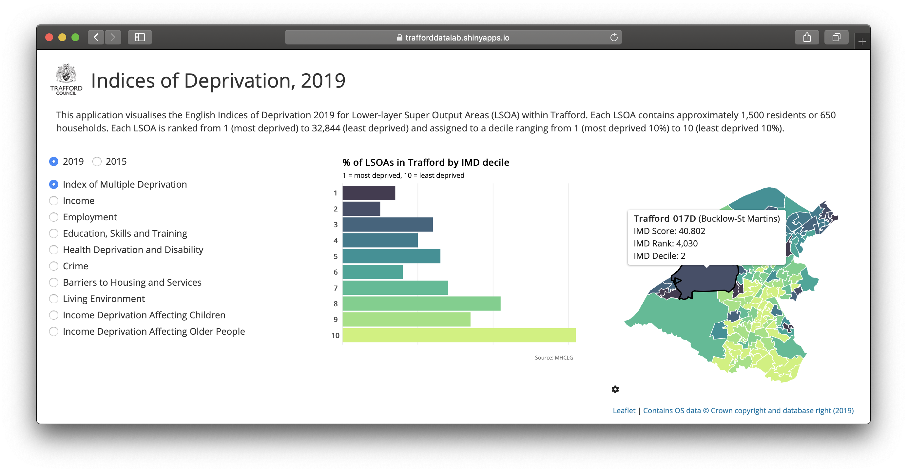

## IMD19
Interactive map showing the [Indices of Deprivation 2019](https://www.gov.uk/government/statistics/english-indices-of-deprivation-2019) (and 2015) for every local authority in England.



The app can be viewed at <a href="https://trafforddatalab.shinyapps.io/imd19" target="_blank">https://trafforddatalab.shinyapps.io/imd19</a>. To run the app locally execute the following code:

``` r
shiny::runGitHub("trafforddatalab/imd19")
```

